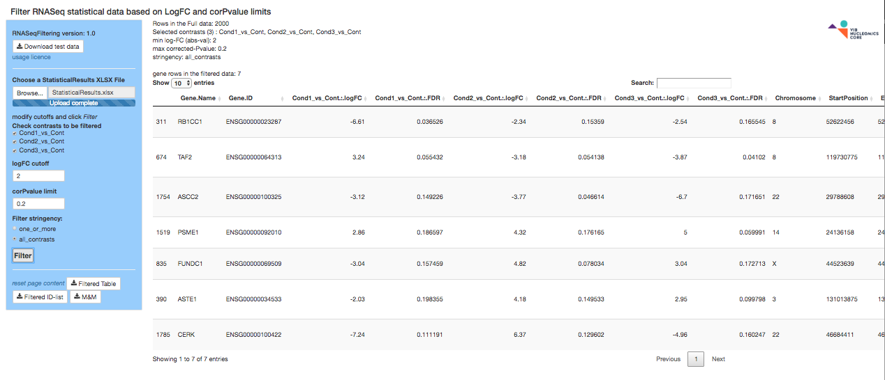
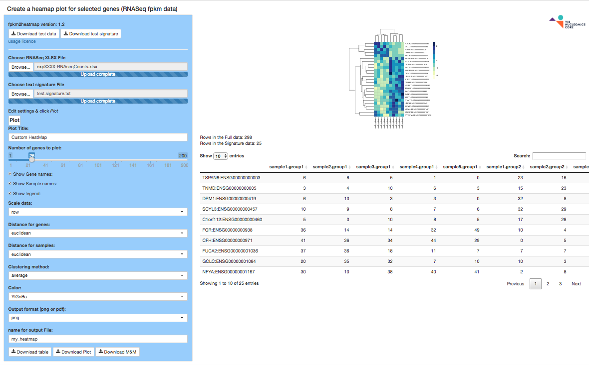
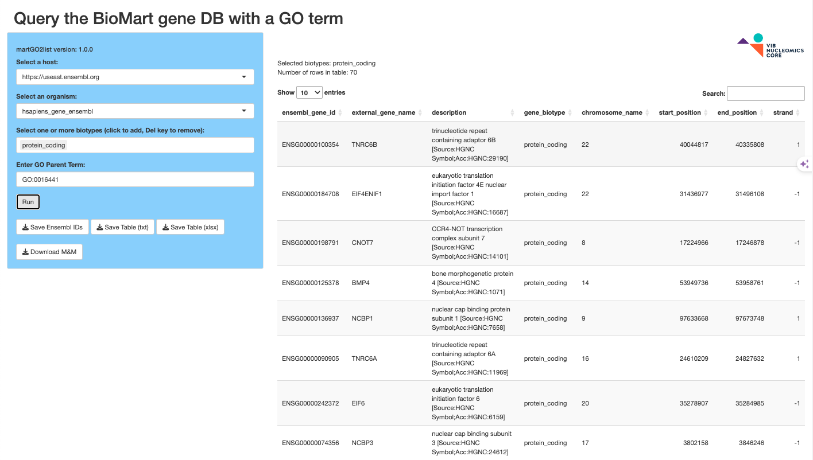
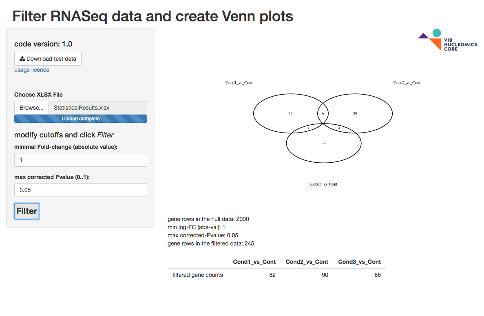

[(Nucleomics-VIB)](https://github.com/Nucleomics-VIB)
 - Shiny-Apps
==========

* All tools presented below have only been tested by me and may contain bugs, please let me know if you find some. Each tool relies on dependencies normally listed at the top of the code (cpan for perl and cran for R will help you add them)*

Please refer to the accompanying **[wiki](https://github.com/Nucleomics-VIB/shiny-apps/wiki)** for examples and workflows.

## Shiny-apps
*[[back-to-top](#top)]*  

Those additional tools belong on a Shiny server and will execute R code in a interactive manner (please refder to https://shiny.rstudio.com/ for info about Shiny).

### **RNASeqFiltering.shinyapp** 
*[[Shiny-apps](#shiny-apps)]*

The **[RNASeqFiltering.shinyapp](RNASeqFiltering)** app loads a *StatisticalResults.xlsx* Excel file provided by the Nucleomics Core and filters it on one or more contrasts with chosen corrected-pvalue and logFC limits. It then saves the results to XLSX and text files for further use. A sample file is present for your convenience.

### **fpkm2heatmap.shinyapp** 
*[[Shiny-apps](#shiny-apps)]*

The **[fpkm2heatmap.shinyapp](fpkm2heatmap)** app loads a FPKM Excel file provided by the Nucleomics Core and a list of EnsEMBL gene IDs (signature) and produced a heatmap plot that can be tuned to your needs. A sample file is present for your convenience.

### **martGO2list.shinyapp** 
*[[Shiny-apps](#shiny-apps)]*

The **[martGO2list.shinyapp](martGO2list)** app takes an organism and a GO term (obtained for instance from **[QuickGO](https://www.ebi.ac.uk/QuickGO/annotations)** and returns a BioMart table of all genes linked to that GO term. The App can be used to produce a list of Ensembl gene IDs to be uploaded in fpkm2heatmap and plot a biological process or pathway of interest together with FPKM values from a RNASeq experiment.

### **RBioanalyzer.shinyapp** 
*[[Shiny-apps](#shiny-apps)]*

The **[RBioanalyzer.shinyapp](RBioanalyzer)** app loads 2 to 3 Bioanalyzer exported csv files and creates an overlay plot. A sample file is present for your convenience.

### **RFilterRNASeq.shinyapp** 
*[[Shiny-apps](#shiny-apps)]*

The **[RFilterRNASeq.shinyapp](RFilterRNASeq)** app loads a StatisticalResults.xlsx file obtained from the Core, filters each contrast based on user input, and creates a Venn plot and a count table. The Venn plot supports up to 5 contrasts and is not created beyond that. A sample excel file with 2000 gene rows is present for your convenience.

*[[back-to-top](#top)]*  

<h4>Please send comments and feedback to <a href="mailto:nucleomics.bioinformatics@vib.be">nucleomics.bioinformatics@vib.be</a></h4>

This work is licensed under a [Creative Commons Attribution-ShareAlike 3.0 Unported License](http://creativecommons.org/licenses/by-sa/3.0/).
# nc-shiny-apps
